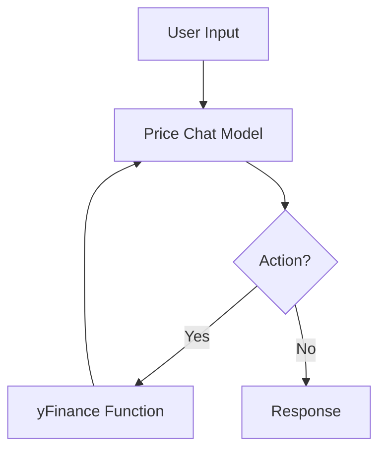

# Stock Price Chat

Stock price chat is an experiment in intent driven instruction and RaG(Retrevial augmented generation) for answer plain text querries for stock prices. This model only handles getting a single stock price from yfinance and replies in plain english.

The model primarily demonstrates a level of NER and translation, taking plain english stock names and converting them to tickers. And NER extracting the plain text date. The model also demonstrates the ability to transform plain text in uniform and structured json to send to an API, without need to explicity describe the api in the system context. Lasty the model demonstrates the ability to extract appropriate information based on a user input from a CSV returned by an API.

## Training

Stock price chat is a fine tuned LORA. It was trained for 3 epocs with NooForge(https://github.com/Nootka-io/nooForge) (yet to be released), which builds on Huggingface Transformers and PEFT. 

The training data is available here:
- <https://github.com/getorca/stock_price_chat/blob/main/data_out/cleaned_eval_stock_prices.jsonl>
- huggingface: <>
- packed and tokenized for training: <>

Bash script for NooForge: <>

## Inference



## Evaluation

Evaluation was run on ~1100 examples <https://github.com/getorca/stock_price_chat/blob/main/data_out/eval_data.json>. 

```
{
    "symbol_accuracy": 0.8604014598540146,
    "date_string_accuracy": 0.9370437956204379,
    "price_accuracy": 0.8001824817518248,
    "response_rouge_score": {
        "rouge1": 0.927610521744467,
        "rouge2": 0.8647191033971113,
        "rougeL": 0.927304307548821,
        "rougeLsum": 0.9273599187598411
    }
}
```
