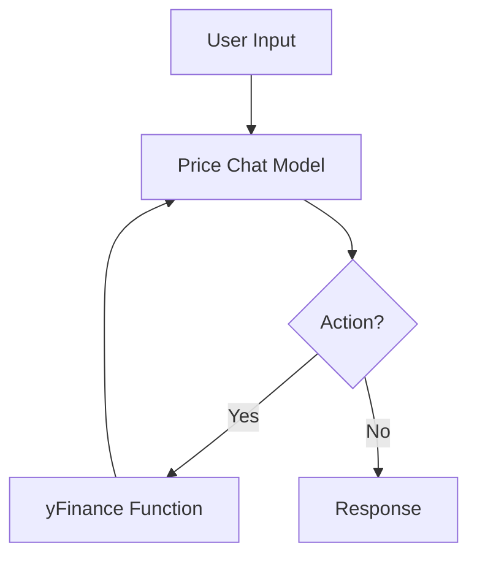

# Stock Price Chat

Stock price chat is an experiment in intent driven instruction and RaG(Retrevial augmented generation) for answer plain text querries for stock prices. This model only handles getting a single stock price from yfinance and replies in plain english. There are a few finance specific models, like FinGPT and BloombergGPT but to our knowledge they primarly focus static data.

Stock Price Chat is designed to extract live and historic information. The model primarily demonstrates a level of NER and translation, taking plain english stock names and converting them to tickers. And NER extracting the plain text date. The model also demonstrates the ability to transform plain text in uniform and structured json to send to an API, without need to explicity describe the api in the system context. Lasty the model demonstrates the ability to extract appropriate information based on a user input from a CSV returned by an API.

## Training

Stock price chat is a fine tuned LORA on Llama 2 7B. It was trained for 3 epocs with NooForge(https://github.com/Nootka-io/nooForge) (yet to be released), which builds on Huggingface Transformers and PEFT. 

Bash script for NooForge: <https://github.com/getorca/stock_price_chat/blob/main/training_scripts/finetune_spc_01.sh>

### Training Data

The training data is available here:
- <https://github.com/getorca/stock_price_chat/blob/main/data_out/cleaned_eval_stock_prices.jsonl>
- huggingface: <>
- packed and tokenized for training: <>


## Inference

The inference script can be found here: <https://github.com/getorca/stock_price_chat/blob/main/inference.py>.  And example of calling it can be found at the bottom of the file in the `if __name__ == '__main__':` block. Further examples can be found in the eval script. All that is needed to call the model is a `input` and a `context_date`, eg:

```python
from datetime import datetime
from inference import Inference


context_date = datetime.now()
chat_history = [{
    'input': 'What is the price of NVIDA today?'
}]
response = inference.do_chat(chat_history, context_date=context_date)
```
note: although `chat_history` is a list only 1 should be sent at a time

The response is returned with the `chat_history` with the `action`, `knowledge`, and `response` objects included. Only the response should be disabled to the user, but `action` and `knowledge` should be available to the user for transparency.

### Basic Archetecture

1 - The user input is sent to the finetuned price chat model. 
2 - The model will either return an action or a response. 
3 - If an action is returned, it is sent to the appropriate api wrapper via the actionIntent.
  - actions are returned as a json string in the following format: `{ 'action': actionIntent, 'params': {params}}`
4 - The response from the API is sent back to the model as `knowledge` with the `user input` and `action` messages. In this case the response is sent as CSV.
5 - The model uses the the entire constructed response to extract the information and return a `response`.
     

### Prompt Format

```
<|SYSTEM|>You are a bot that provides stock prices. From a user input first create an action with the ticker and date in a jsons string. If you are sent an action and knowledge create the response with the stock price from the provided knowledge for the date the user asks.<|END_SYSTEM|>
<|INPUT|>user input<|END_INPUT|>  
<|ACTION|>action string generated by the model<|END_ACTION|>
<|KNOWLEDGE|>knowledge string returned via the api call<|END_KNOWLEDGE|>
<|RESPONSE|>plain text response generated by the model<|END_RESPONSE|>
```

The above template is created when `inference.do_chat()` is called.

## Evaluation

Evaluation was run on ~1100 examples, seperate from the training data.

Evaluation data: <https://github.com/getorca/stock_price_chat/blob/main/data_out/cleaned_eval_stock_prices.jsonl>.
Evaluated sample response: <https://github.com/getorca/stock_price_chat/blob/main/data_out/eval_data.json>. 

The eval script is available here: <https://github.com/getorca/stock_price_chat/blob/main/eval.py>.

Accuracy was chosen as the primary metric for evaluating the model. Accuracy is a good metric since we're more concerned about absolute values, very similar to a labeling task including the extraction and tanslation of the stock to a ticker symbol, the extracted date string, and the final price extracted from the `knowledge` context. Accuracy for the 3 metrics was calulated with scikit-learn accuracy with the following forumula:

```math
\texttt{accuracy}(y, \hat{y}) = \frac{1}{n_\text{samples}} \sum_{i=0}^{n_\text{samples}-1} 1(\hat{y}_i = y_i)
```

Rouge score was calculated on the response, however it's not overly useful, until comparing to other variants. 

```
{
    "symbol_accuracy": 0.8604014598540146,
    "date_string_accuracy": 0.9370437956204379,
    "price_accuracy": 0.8001824817518248,
    "response_rouge_score": {
        "rouge1": 0.927610521744467,
        "rouge2": 0.8647191033971113,
        "rougeL": 0.927304307548821,
        "rougeLsum": 0.9273599187598411
    }
}
```

We can expect to `price_accuracy` to always be wrong if either or both of `symbol_accuracy` or `date_string_accuracy` are wrong, and as such as these two metrics improve we can expect price accuracy to improve.

Further eval could be done to find out what style of dates are failing, as well as what style of symbols. Further limitations are enchancement are discussed in the section "Limitations and Further Improvements" below.

## Limitations and Further Improvements

1) FinanceDatabase(https://github.com/JerBouma/FinanceDatabase) was used for creating the plain text names and ticker symbols. An adhock look at the database shows there are maybe some errors in the data, as well as missing names like facebook for meta. Further improvements will likely result from a better dataset for creating ticker/name pairs. This can also further enhance a more natural language understanding of stock names. An aditional way to introduce a better natural language understanding is to indroduce more training data that discuss stocks in natural language. 

2) The model is currently limited to a single day's price and a single ticker symbol. The usefulness of the model should be extended by supplying data for multiple days, multiple tickers, and even rendering interactive charts. LLMs fundementally struggle with math so it would be worth seriously considering if the model should be relied on to compair differences in prices, between datas and tickers, or if it should be further trained to with "math actions" to use a caluclator.

3) Enhancing the model for information retrevial on further funmental stock tasks, including; returning volume, market cap, etc, can further enchance the usefulness of the model. 

4) PriceParser(https://github.com/scrapinghub/price-parser) used for converting human dates to python datatime objects fails to parse some formats.

5) It is uncertain is the system message adds any value in an intent/action model, since the intent can drive as the rompt for what the model should perform. Although a system message was included here, our theory is system prompts will add little to no value on an intent/action model, especially with multiple intents and actions. Further experiments need to be done.

6) The model currently only supports single turn generation. This limits the ability to continue discussions about data in other ways, or even introduce other data. Future models should support multi-turn prompting, and even be able to add additional actions and knowledge. 
